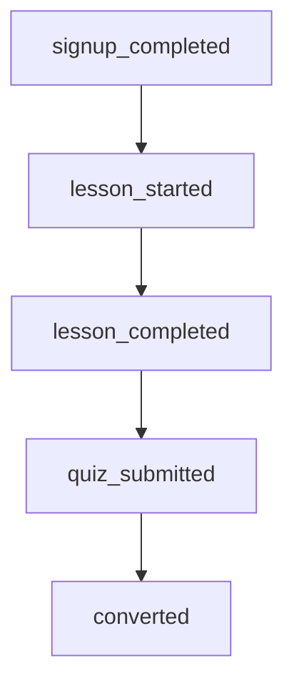

# 📘 Startie 구독 전환 활성화 프로젝트

무료체험 기반 온라인 교육 플랫폼 **Startie**의 유료 전환 최적화를 위한 Product Data Analysis 프로젝트

> 핵심 질문: **무료체험 7일 안에 어떤 경험이 유료 구독 전환을 만드는가?**

---

# 📌 1. Project Overview

## Startie 서비스 소개

Startie는 커리어 전환을 준비하는 20~34세 사용자를 대상으로 하는 온라인 교육 플랫폼입니다.
* `주요 타겟: 20~30대 커리어 전환자 (비전공자 → 데이터/개발/기획)`
* 런칭 10개월차
* 누적 가입자 20,000명
* MAU 5000명
* **7일 무료체험 → 유료 구독 전환 구조**
* Basic / Pro 구독 모델 운영

## 비즈니스 목표

무료체험 사용자 유료 전환율 개선 및 MRR 성장

## 핵심 질문

**"유저는 어떤 행동을 할 때 서비스의 가치를 체감하고 결제하는가?"**


---

#  2. Key Metrics

| Metric               |        Value |
| -------------------- | -----------: |
| Total Revenue        | ₩178,681,500 |
| MRR                  |  ₩35,736,300 |
| Paid Users           |        3,920 |
| Paid Conversion Rate |        27.9% |
| ARPPU                |       ₩9,116 |

---

# 3. Repository 구조 (최신화)

```text
Startie/

├─ notebook/            
├─ overview/      
├─ image/             
├─ outputs/
│  ├─ DA_results/        
│  └─ ppt/                
├─ pda/
│  ├─ AARRR/             
│  └─ A_B_Test/           
├─ table/                 
└─ README.md
```

### 핵심 산출물 경로
- 최종 발표 자료: `outputs/ppt/Startie_PDA.pdf`
- 보고서형 흐름 문서: `outputs/ppt/startie_presentation_flow.md`
- 핵심 그래프: `outputs/DA_results/`

---
<br>

# 4. 분석 설계

## 1) AARRR Framework
> 활성화 단계 집중 분석

| 단계 | 핵심 질문 | 핵심 지표 | 산출 방법 |
|------|------------|------------|------------|
| Acquisition | 사용자가 얼마나 유입되는가? | DAU | 일별 회원가입 수 |
| **`Activation`** | "이 앱 괜찮네"라고 느끼는 순간은? | 핵심 기능 사용률 | 퀴즈 제출 코호트별 전환율 |
| Retention | 계속 돌아오는가? | 구독 유지 개월 수 | D30 Retention - 구독 n개월 유지율, 이탈률 |
| Revenue | 무료에서 유료로 전환하는가? | 무료체험 종료 후 유료 전환율 | ARPU - 비용 |
| Referral | 다른 사람에게 추천하는가? | 초대 메시지 발송 | 공유 이벤트 수 |

---

## 2) Aha Moment 정의

### 원인 가설

```
강의 시청보다 직접 퀴즈를 제출하는 행동이 유료 전환과 더 강하게 연결될 것이다.
```
### 결과

| 행동           | 전환율 |
| ------------------ | --------------: |
| quiz_submitted = 0 |             24% |
| quiz_submitted = 1 |             41% |

## `Aha Moment`

**강의 완료 후 퀴즈를 풀며 "이해했다"는 효능감을 느끼는 순간**

---

## 3) 사용자 행동 분석

### 수강 완료

| Count | 전환율 |
| ----: | --------------: |
|     0 |             15% |
|     1 |             28% |
|     4 |             40% |

### 퀴즈 경험 코호트

| 조건 | 전환율 |
| --------- | --------------: |
| 없음        |             25% |
| 있음        |             49% |

---

## 4) Funnel 설계


| Step | Event | Description |
|------|-------|-------------|
| 1 | signup_completed | 회원가입 완료 |
| 2 | lesson_started | 첫 강의 시작 |
| 3 | lesson_completed | 강의 완료 |
| 4 | quiz_submitted | 퀴즈 제출 |
| 5 | converted | 유료 전환 |
---

## 병목지점

`lesson_completed → quiz_submitted`

| Step             | Reach Rate |
| ---------------- | ---------: |
| lesson_completed |      77.8% |
| quiz_submitted   |      29.9% |

---

# 5. Key Insight

```
수강 행동은 전환율을 높이지만, 가장 큰 상승은 퀴즈 행동에서 발생 
즉, "보는 공부보다 푸는 공부가 결제를 만든다."
```
---

# 6. Action Plan

> ## 제언1

강의 핵심 구간마다 실시간 퀴즈 팝업 삽입

> ## 제언2

강의 진행률 일부를 퀴즈 완료와 연동

예시:

* 강의 시청 90~97%
* 마지막 완료율은 퀴즈 제출 시 반영

---

# 7. 기대 효과
| Metric | Current | Target | 
|--------|--------:|-------:| 
| Aha Moment Reach | baseline | +10% | 
| Paid Conversion Rate | 27.9% | 32.0% | 
| MRR | baseline | +20% |

---
# 8. 비즈니스 기대효과
>무료체험 기간 내 핵심 행동 도달률을 높이면  
결제 전환 골든타임(7일 이내)에서 전환 효율을 높일 수 있음

---
# 9. 결론

데이터 분석 결과  단순 강의 시청보다 **퀴즈 참여 행동이 유료 전환과 가장 강하게 연결**되었다.

즉 Startie의 핵심 성장 전략은

**사용자가 이해했다는 확신(Aha Moment)을 더 빠르게 경험하도록 설계하는 것**이다.

---


# 10. 프로젝트 한계

- 본 분석은 제공된 이벤트 로그를 기반으로 진행되어  
  실제 사용자 인터뷰, 설문, 정성 데이터는 반영되지 않음

- 무료체험 종료 이후 장기 구독 유지 여부(LTV, 장기 리텐션)까지는 분석 범위에 포함되지 않음

- quiz_submitted 행동과 전환율 간 높은 상관은 확인되었으나  
  직접적인 인과관계는 A/B Test를 통해 추가 검증 필요

- 디바이스별(Web / iOS / Android) 행동 차이는 본 프로젝트에서 별도 분리하지 않음

---

# 11. 확장 아이디어

- 디바이스별 퍼널 분석을 통해 UX 병목 구간 추가 탐색

- quiz 유형별(객관식 / 단답형 / 즉시 피드백형) 전환율 비교 실험

- Basic → Pro 업셀링 행동 분석을 통한 플랜별 차별 전략 도출

- 장기 구독 유지 코호트 분석 기반 Retention 개선 전략 확장

- quiz 참여 이후 재방문 행동까지 연결하여 Activation → Retention 구조 분석

---

# 12. 실행 환경

| Category | Stack |
|----------|-------|
| 언어 | Python |
| 데이터 분석 | Pandas, NumPy |
| 시각화 | Matplotlib, Plotly |
| Notebook | Jupyter Notebook |
| 협업관리 | Git / GitHub / Slack / Notion /  |
| IDE | VS Code / Google Colab |

---

# 13. 팀 구성 및 역할

| 이름 | 담당 업무 |
|------|------|
| 김○비 | 사용자 행동 분석 및 Aha Moment 정의 |
| 김○건 | 사용자 행동 분석 및 병목 구간 도식화 |
| 박○현 | KPI 정의 및 퍼널 분석 |
| 최○민 | 프로젝트 Management |
| 김○연 | 아이디어 기획 및 분석 프레임워크 정의 |

---
